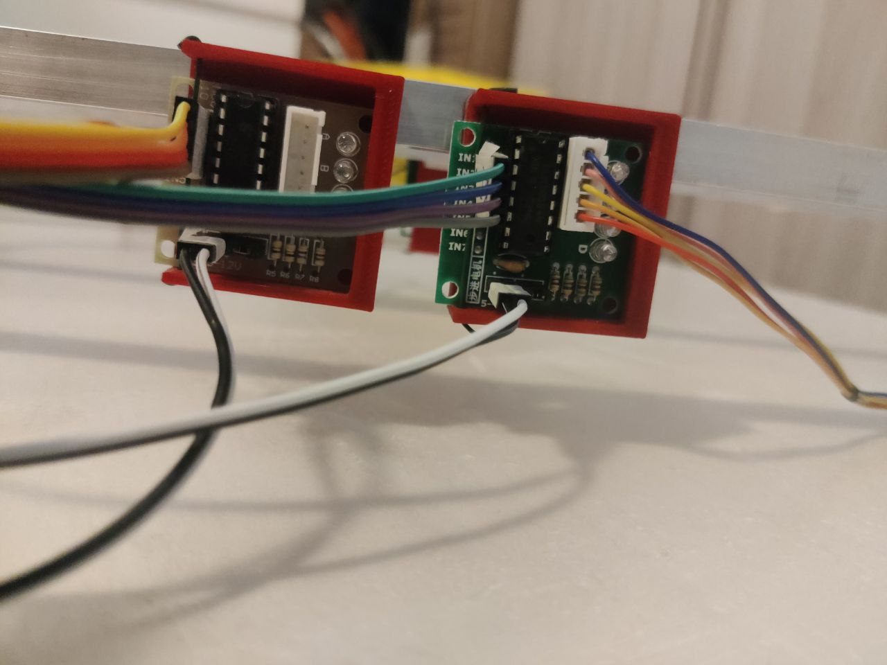
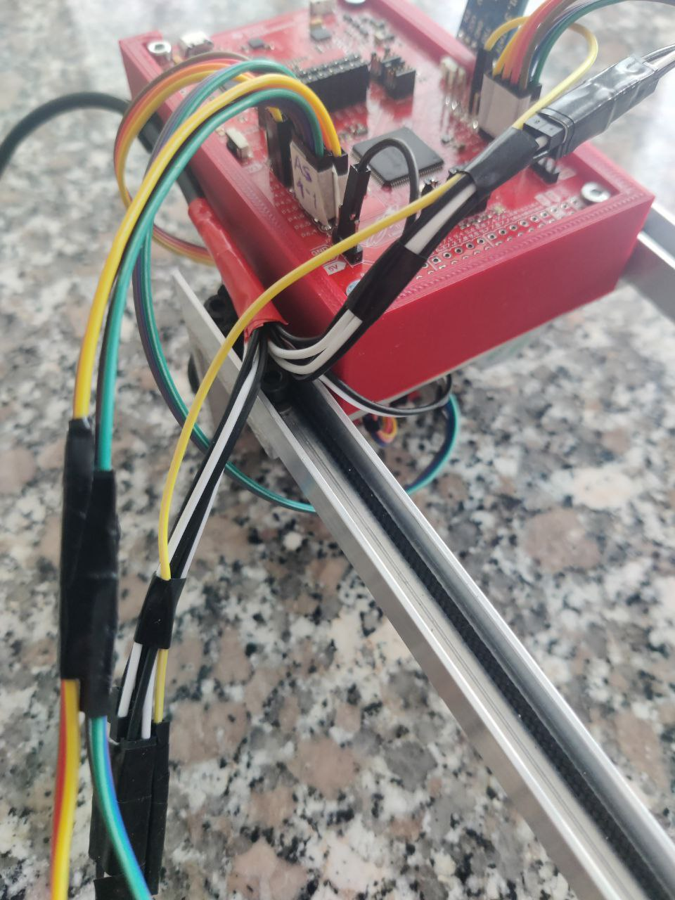
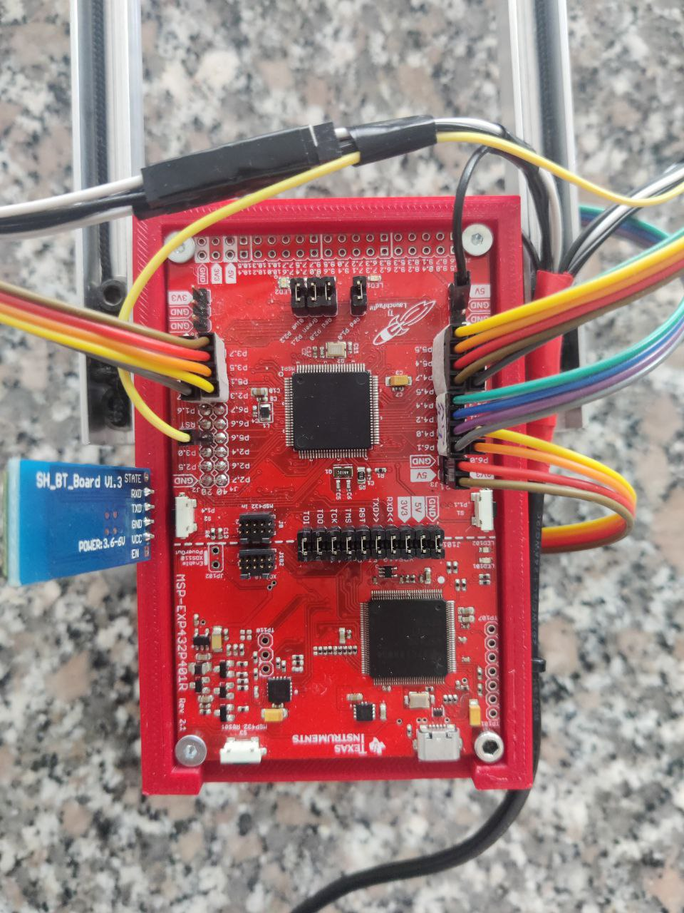

<h1 align="center">Claw Machine</h1>
<p align="center">
  
</p>

---

This project tries to find out what a real claw machine entails, be either a big one to unload cargo ships or a small one that one may find at a festival.<br>
"What challenges does a claw machine face?", "How do you go about to solve them?", basically, "How does it work?".
These and many others were the questions we had in mind when we decided to start to work on this project.

Due to our limited resources and time, we had to build an even limited machine which, unfortunatly, is not fit for harbor work. Nor festival work. But we believe that we learned a lot anyway.

<div align="center">
<h3>Our Claw Machine!</h3>
<p>
  
</p>
</div>

# Requirements

### Hardware

To use this project, you will need the following hardware:

- 2x Texas Instruments MSP432P401R microcontroller
- 1x [Educational BoosterPack MKII](https://www.ti.com/tool/BOOSTXL-EDUMKII)
- Bluetooth modules:
  - 1x HC-05
  - 1x HC-06
- 4x Aluminium bars 20x20x500mm and 4x aluminium bars 20x20x40mm for the frame
- 4x Aluminium U profiles 500mm long for the rails of both carts. They should be wide enough to keep the wheels inside and tight enough to keep them driving straight
- 4x Aluminium L profiles (50x50x100mm), 2x aluminium for fixing wheels, motors and rails of both the two carts
- 2x Aluminium profiles to build the smaller cart
- 8x Wheels
- 1x Reel for winding the cable
- 1x Microservo for moving the claw
- 5x 28BYJ-48 stepper motors
- 5x ULN2003 stepper motors' driver
- 5x [Motor driver supports](./SupportsSTLs\motor_driver_support.stl)
- [Support for the MSP board](./SupportsSTLs\MPS432_support.stl)
- [Claw Grabber](https://www.thingiverse.com/thing:4826548/files)
- Jumper wires
- A rope to connect to the claw
- A 5V - 2A power supply (we used a USB cable connected to a powerbank)
<p float="left">
  
  
</p>

### Software

- [Code Composer Studio](https://www.ti.com/tool/CCSTUDIO) Integrated Development Environment (IDE)
- [MSP432 DriverLib](https://www.ti.com/tool/download/SIMPLELINK-MSP432-SDK/3.40.01.02)

# Project layout

```
├── README.md
├── SupportsSTL                      # STLs to print for the supports of the boards
├── readme_images
│    └── images                      # Images used in the README
├── presentation.pdf                 # Presentation's slides
└── source
     ├── Controller                  # Everything that is on the controller side
     │    ├── bluetooth              # Manages bluetooth connection and its tests
     │    │    └── BluetoothLibrary  # Libraries bluetooth
     │    ├── Graphics               # Manages all the screen that can be displayed
     │    │    ├── Images            # Bitmaps for the images used
     │    │    └── LcdDriver         # Manages the LCD setup
     │    ├── include                # Libraries for the FSM
     │    ├── Release
     │    ├── targetConfigs
     │    ├── ControllerFSM.c        # Controls the FSM
     │    ├── InterruptHandler.c     # Handles interrupts from the boosterpack
     │    └── main.c                 # Main source code
     └── motors                      # Manages what is on the machine side
          ├── bluetooth              # Manages bluetooth connection
          ├── claw_machine_driver    # Manages claw machine movements
          │    └── hardware          # Hardware-level libraries to control the motors
          ├── Debug                  # Compiled files
          ├── targetConfigsv
          └── main.c                 # Main source code
```

# Getting started

### Setting up the hardware

1. Build the frame.<br>
<div>
   Since the chassis' dimensions do not directly affect the software, it can be built following the weight, transportability and strength requirements of the specific project. Since these changes may require some software changes, we will show how we built ours:

  <p float="left">
    
    
    
  </p>
  Our frame was designed to be disassembled and reassembled in a short time and take up as little space as possible that it could be transported easily. Aluminium was also used to make the structure lighter, but at the same time very durable. In particular, the legs of the frame can be folded inward making the entire frame flat, while the trolleys rest on rails and can be removed by disconnecting the cables with quick-release connectors.
  <p float="left">
    
    
  </p>
  The electronic part, on the other hand, consists of two separate circuits: one for powering the motors and the other for the signals sent from the MSP432 board to the various peripherals: stepper, servo and HC-06 bluetooth module. The two circuits share the grounding.
  <p float="left">
    
    
    
  </p>
  Each stepper motor is connected to its ULN2003 driver that allows it to interface with the MSP board. Specifically, this driver has 6 connections: 5V and GND from the power supply and 4 input pins to control its motion.

The servo, on the other hand, is controlled by PWM so it is connected to the power supply with the 5V and GND pins and to the board with only one input pin.

</div>

2. Connect the **BoosterPack MKII** to the hand-held **MSP432P401R Launchpad**.
3. Bluetooth setup
   - **HC-05** Configuration
     - Send it the following AT commands:
       - `AT+ROLE=1`
       - `AT+CMODE=1`
       - `AT+UART=9600,0,0`
       - `AT+PSWD=1234`
     - Connect it to the hand-held controller.
       - Connect the HC-05 to a GND and a 5V pins of the board.
       - Connect the TXD wire to the pin 3.2 and the RXD wire to the pin 3.3 of the board.
   - **HC-06** Configuration:
     - Send it the following AT commands:
       - `AT+BAUD4`
       - `AT+PIN1234`
     - Connect it to the machine.
       - Connect the HC-06 to a GND and a 5V pins of the board.
       - Connect the TXD wire to the pin 3.2 and the RXD wire to the pin 3.3 of the board.
4. Stepper motor setup
   - Connect each motor input to the MSP according to the pin mapping specified in the [config.h](./source\motors\claw_machine_driver\config.h) file.
5. Claw setup
   - Print and assemble the claw, click [here](https://www.thingiverse.com/thing:4826548#Summary) for instructions.
   - Connect the servo to the power supply and the board on pin 5.7.
     - You may need to change the servo's opening and closing bounds based on how the assembly was done.
     - This can be done by changing the `SERVO_MIN_POSITION` and `SERVO_MAX_POSITION` parameters within the [config.h](./source\motors\claw_machine_driver\config.h) file.

### Setting up the software

1. Clone this GitHub repo by using:

```sh
git clone https://github.com/Clown-Machine/ClawMachine.git
```

2. Import `source/controller`'s project in **Code Composer Studio**. This will be run in the handheld board.
3. Go to: _Project → Properties → Build → Arm Compiler → Include Options_ and add the _source_ directory located in _simplelink_msp432p4_sdk_3_40_01_02/_
4. Go to: _Project → Properties → Build → Arm Linker → File Search Path_ and add:
   - _msp432p4xx_driverlib.lib_ directory located in _[..]/source/ti/devices/msp432p4xx/driverlib/ccs/_
   - _grlib.a_ located in _[..]/source/ti/grlib/lib/ccs/m4f/_
5. Build and run the project. The Launchpad should now be displaying the graphics.
6. Import `source/motors`'s project in **Code Composer Studio**. This will be run in the machine's board.
7. Go to: _Project → Properties → Build → Arm Compiler → Include Options_ and add the _source_ directory located in _simplelink_msp432p4_sdk_3_40_01_02/_
8. Go to: _Project → Properties → Build → Arm Linker → File Search Path_ and add:
   - _msp432p4xx_driverlib.lib_ directory located in _[..]/source/ti/devices/msp432p4xx/driverlib/ccs/_
9. Build and run the project.

### How to burn

Once the project is loaded on the boards, it is sufficient to provide power to run everything properly.

# User guide

1. Follow the instruction displayed on the screen.
2. Keep in mind:
   Starting up the controller may take some time as the device must connect itself to the claw machine through a Bluetooth connection. Wait for the LEDs on both devices to stop blinking.
   - Click Button 1 (higher button on boosterpack) to interchange between Manual and Automatic movement mode.
     - Manual:
       - You will be able to move the cart on the claw machine horizontally by moving the joystick: left, right, back and forth.
       - Click the Joystick Push button to change movement to vertical mode. By moving the joystick around, you will be able to move the gripper as you like:
         - Up: raise the gripper
         - Down: lower the gripper
         - Left: close the gripper
         - Right: open the gripper
           -Click the Joystick Push button to interchange between horizontal and vertical movement.
       - Click Button 2 (lower button on the boosterpack) to select on the screen the slot where you wish to save the position you just reached in the claw machine. Click Button 2 again to overwrite the slot and then Button 1 to go back to Manual movement mode.
     - Automatic:
       - The positions you reached and saved previously in Manual movement mode will appear on the screen. You can now select the position you want by moving up and down with the joystick and by clicking Button 2.
       - The claw machine will automatically get into the desired position.
3. Have fun!

Testing Note:

- In order to test the proper communication between controller and machine before playing with it, it is possible to compile the project excluding from the build the [main.c](./source\Controller\main.c) file and including in its place the file [TestMainSlave.c](./source\Controller\bluetooth\TestMainSlave.c) (on the machine) and the file [TestMainMaster.c](./source\Controller\bluetooth\TestMainMaster.c) (on the controller). Once the test is complete, exclude the testing files and re-include [main.c](./source\Controller\main.c).

<p align="center">
  
</p>
<p align="center">
  
</p>

# Link to powerpoint and Youtube video

- Youtube [video](https://youtu.be/jCsASMP_P0s)
- PowerPoint [slides](https://docs.google.com/presentation/d/1NUo6HDtRyt_ihvcuS94CyRr47OZp8XRaCx5JYKxsm4A/edit?usp=sharing)

# Team members

The project was a developed in a team and the code was divided into many different areas (Claw, Communications, Graphics, Hardware, ...); each member focused therefore only on certain aspects of the project.

- Luca Podavini (Leader)
  - Contributed mainly to the creation of the physical claw machine and the control module of each motor, synchronizing the movements of the main cart, secondary cart and the gripper.
- Alberto Cimmino
  - Contributed mainly to the GUI of the controller and Bluetooth comunication between the controller and the claw machine. Was responsible of merging the various project modules, reviewing the code, the testing phase and the YouTube demo.
- Angela Hu
  - Contributed mainly to the implementation of the controller, setting it up, handling its functionalities and dealing with the logic of the system control flow.
- Sara Tait
  - Contributed mainly to the Bluetooth comunication module, command encoding, management of the wireless control of the claw machine movements, the testing phase and the YouTube demo.
